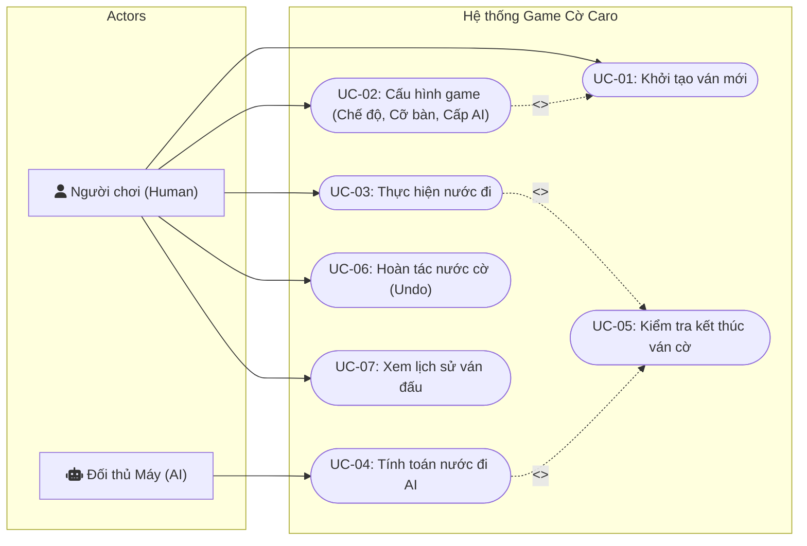
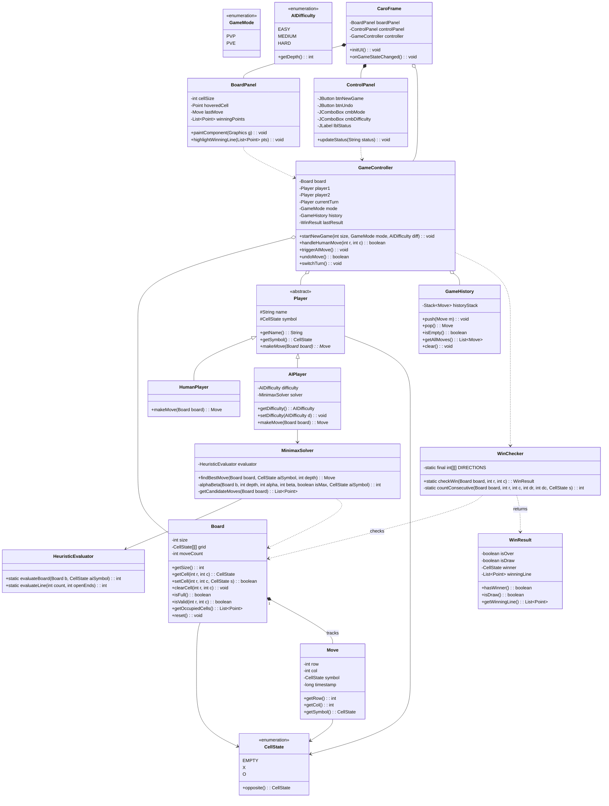
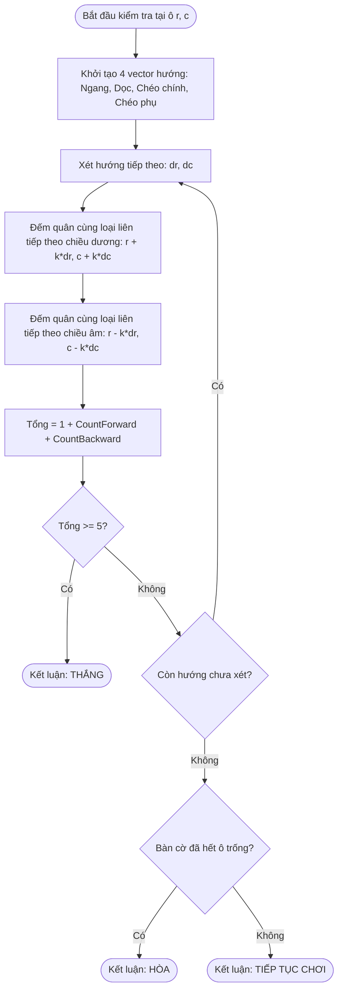
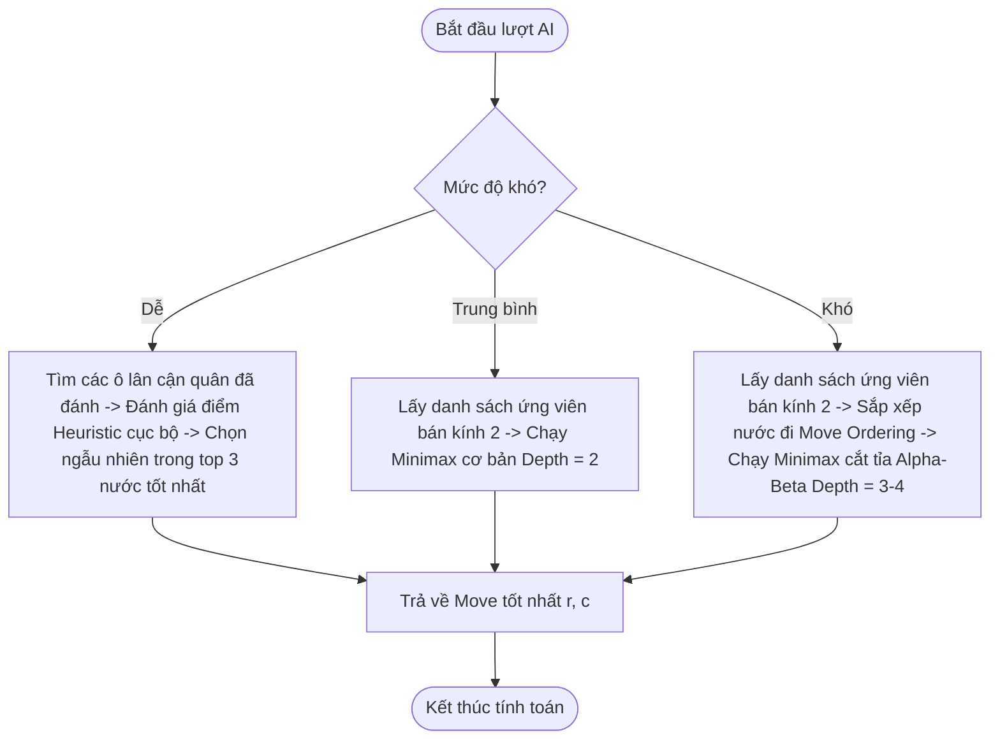
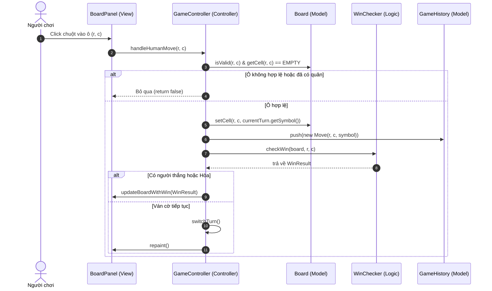
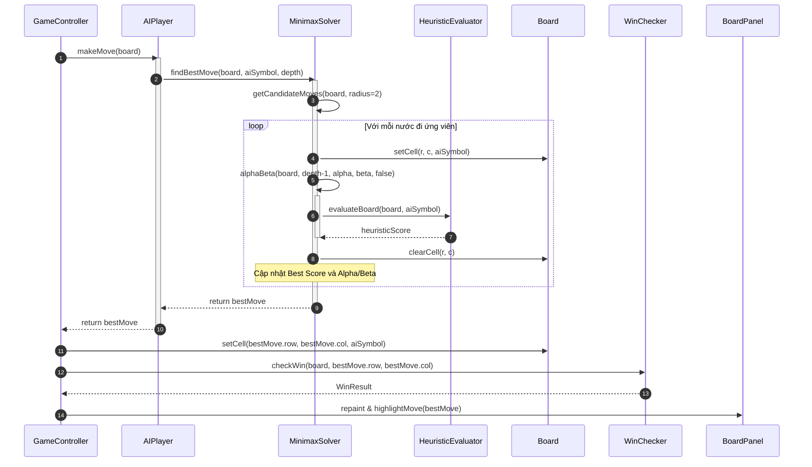
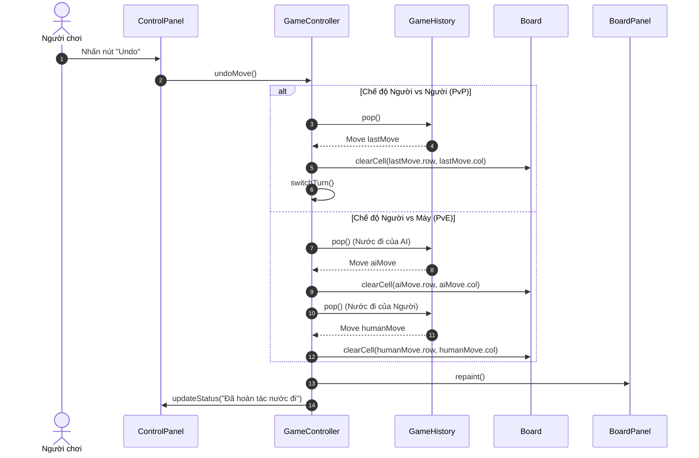

# BÁO CÁO PHÂN TÍCH YÊU CẦU VÀ THIẾT KẾ HỆ THỐNG
## DỰ ÁN: GAME CỜ CARO (GOMOKU) CÓ GIAO DIỆN ĐỒ HỌA & TRÍ TUỆ NHÂN TẠO (AI)

**Học phần:** Đồ án cơ sở  
**Sinh viên thực hiện:** Từ Văn Huy Hoàng  
**Mã sinh viên / Lớp:** k24CSE  
**Giai đoạn:** Tuần 1 - 2 (Phân tích yêu cầu, Thiết kế kiến trúc & Sơ đồ hệ thống)

---

# MỤC LỤC
1. [GIỚI THIỆU VÀ TỔNG QUAN HỆ THỐNG](#1-giới-thiệu-và-tổng-quan-hệ-thống)
2. [PHÂN TÍCH YÊU CẦU HỆ THỐNG (SRS)](#2-phân-tích-yêu-cầu-hệ-thống-srs)
   - [2.1. Yêu cầu chức năng (Functional Requirements)](#21-yêu-cầu-chức-năng-functional-requirements)
   - [2.2. Yêu cầu phi chức năng (Non-Functional Requirements)](#22-yêu-cầu-phi-chức-năng-non-functional-requirements)
3. [THIẾT KẾ USE-CASE (USE-CASE DIAGRAM & SPECIFICATIONS)](#3-thiết-kế-use-case-use-case-diagram--specifications)
   - [3.1. Sơ đồ Use-Case tổng quát](#31-sơ-đồ-use-case-tổng-quát)
   - [3.2. Bảng đặc tả các Use-Case chính](#32-bảng-đặc-tả-các-use-case-chính)
4. [THIẾT KẾ KIẾN TRÚC VÀ SƠ ĐỒ LỚP (CLASS DIAGRAM)](#4-thiết-kế-kiến-trúc-và-sơ-đồ-lớp-class-diagram)
   - [4.1. Kiến trúc mô hình MVC](#41-kiến-trúc-mô-hình-mvc)
   - [4.2. Sơ đồ lớp chi tiết (Class Diagram)](#42-sơ-đồ-lớp-chi-tiết-class-diagram)
   - [4.3. Phân tích các nguyên lý OOP được áp dụng](#43-phân-tích-các-nguyên-lý-oop-được-áp-dụng)
5. [THIẾT KẾ SƠ ĐỒ HOẠT ĐỘNG (ACTIVITY DIAGRAM)](#5-thiết-kế-sơ-đồ-hoạt-động-activity-diagram)
   - [5.1. Luồng ván đấu tổng quát](#51-luồng-ván-đấu-tổng-quát)
   - [5.2. Luồng xử lý nước đi và kiểm tra thắng/thua O(1)](#52-luồng-xử-lý-nước-đi-và-kiểm-tra-thắngthuahòa-o1)
   - [5.3. Luồng ra quyết định của AI (Minimax & Alpha-Beta)](#53-luồng-ra-quyết-định-của-ai-minimax--alpha-beta)
6. [THIẾT KẾ SƠ ĐỒ TUẦN TỰ (SEQUENCE DIAGRAM)](#6-thiết-kế-sơ-đồ-tuần-tự-sequence-diagram)
   - [6.1. Sơ đồ tuần tự nước đi người chơi (Human Move)](#61-sơ-đồ-tuần-tự-nước-đi-người-chơi-human-move)
   - [6.2. Sơ đồ tuần tự nước đi của AI (AI Move Execution)](#62-sơ-đồ-tuần-tự-nước-đi-của-ai-ai-move-execution)
   - [6.3. Sơ đồ tuần tự chức năng Hoàn tác (Undo Move)](#63-sơ-đồ-tuần-tự-chức-năng-hoàn-tác-undo-move)
7. [THIẾT KẾ THUẬT TOÁN CỐT LÕI](#7-thiết-kế-thuật-toán-cốt-lõi)
   - [7.1. Thuật toán kiểm tra thắng thua cục bộ O(1)](#71-thuật-toán-kiểm-tra-thắng-thua-cục-bộ-o1)
   - [7.2. Thuật toán Minimax và Cắt tỉa Alpha-Beta](#72-thuật-toán-minimax-và-cắt-tỉa-alpha-beta)
   - [7.3. Thiết kế hàm đánh giá Heuristic và Bảng điểm thế cờ](#73-thiết-kế-hàm-đánh-giá-heuristic-và-bảng-điểm-thế-cờ)
8. [KẾ HOẠCH BÀN GIAO CHO TUẦN 3-4](#8-kế-hoạch-bàn-giao-cho-tuần-3-4)

---

## 1. GIỚI THIỆU VÀ TỔNG QUAN HỆ THỐNG

Trò chơi Cờ Caro (Gomoku) là một trò chơi đối kháng bàn cờ kinh điển. Hệ thống được phát triển nhằm mục đích:
- Ứng dụng toàn diện kiến thức Lập trình hướng đối tượng (OOP) bằng ngôn ngữ **Java**.
- Thiết kế kiến trúc phần mềm chuẩn mô hình **Model-View-Controller (MVC)**, tách biệt rành mạch giữa giao diện (View), dữ liệu bàn cờ (Model), bộ điều khiển luật chơi (Controller), và trí tuệ nhân tạo (AI Engine).
- Tối ưu hóa hiệu năng tính toán: áp dụng thuật toán kiểm tra thắng thua cục bộ với độ phức tạp thời gian $O(1)$, thuật toán cây trò chơi **Minimax** kết hợp kỹ thuật **cắt tỉa Alpha-Beta (Alpha-Beta Pruning)**, kỹ thuật lọc vùng lân cận (Radius = 2) và sắp xếp nước đi (Move Ordering).

---

## 2. PHÂN TÍCH YÊU CẦU HỆ THỐNG (SRS)

### 2.1. Yêu cầu chức năng (Functional Requirements - FR)

| Mã yêu cầu | Tên chức năng | Mô tả chi tiết |
| :--- | :--- | :--- |
| **FR-01** | Khởi tạo bàn cờ tùy chỉnh | Cho phép tạo bàn cờ với kích thước từ $10\times10$ đến $20\times20$ (mặc định $15\times15$). Bàn cờ sạch, lưới kẻ sắc nét. |
| **FR-02** | Chọn chế độ chơi | Hỗ trợ 2 chế độ: Người vs Người (PvP trên cùng máy) và Người vs Máy (PvE). |
| **FR-03** | Cấu hình người chơi & quân cờ | Thiết lập tên người chơi, chọn quân cờ đi trước (X) hoặc đi sau (O). |
| **FR-04** | Chọn cấp độ AI | Cung cấp 3 mức độ AI: Dễ (Heuristic + Random), Trung bình (Minimax Depth 2), Khó (Alpha-Beta Minimax Depth 3-4 + Heuristic sâu). |
| **FR-05** | Xử lý nước đi & chuyển lượt | Tiếp nhận click chuột từ người chơi hoặc tính toán tự động từ AI. Kiểm tra ô hợp lệ, cập nhật trạng thái ô, đổi lượt luân phiên và tô sáng nước đi gần nhất. |
| **FR-06** | Kiểm tra kết quả ván cờ | Tự động xác định Thắng khi có đủ 5 quân cùng loại liên tiếp (ngang, dọc, chéo chính, chéo phụ) và Hòa khi đầy bàn cờ. |
| **FR-07** | Hoàn tác nước đi (Undo) | Ở chế độ PvP: hoàn tác 1 nước cờ gần nhất; Ở chế độ PvE: hoàn tác cả cặp nước cờ (nước của người chơi và nước của AI) để người chơi tiếp tục lượt. |
| **FR-08** | Bắt đầu ván mới (New Game) | Làm sạch bàn cờ, đặt lại điểm số và trạng thái sẵn sàng cho ván đấu tiếp theo. |
| **FR-09** | Quản lý lịch sử ván cờ | Ghi nhận chuỗi nước đi có đánh dấu tọa độ, thời gian, người thực hiện để phục vụ tính năng xem lại hoặc lưu file. |

### 2.2. Yêu cầu phi chức năng (Non-Functional Requirements - NFR)

1. **Hiệu năng (Performance - NFR-01):** 
   - Kiểm tra thắng thua tức thời trong thời gian dưới $1\text{ ms}$ ($O(1)$) sau mỗi nước cờ.
   - Thời gian AI phản hồi nước đi không vượt quá $1.5\text{ giây}$ ở mọi chế độ khó trên máy tính thông thường.
2. **Khả năng mở rộng & Bảo trì (Maintainability - NFR-02):**
   - Module AI hoàn toàn độc lập với GUI thông qua giao diện interface trừu tượng. Có thể thay thế hoặc nâng cấp giải thuật AI (MCTS, Heuristic khác) mà không ảnh hưởng tới View.
3. **Tính tiện dụng & Trực quan (Usability - NFR-03):**
   - Giao diện đồ họa trực quan, hiện đại, màu sắc hài hòa, có chỉ thị lượt chơi, tô sáng nước đi vừa đánh và gạch đường chiến thắng (Winning line highlight).
4. **Tính di động & Độc lập môi trường (Portability - NFR-04):**
   - Hoạt động ổn định trên các hệ điều hành phổ biến (Windows, macOS, Linux) cài đặt Java 11+.

---

## 3. THIẾT KẾ USE-CASE (USE-CASE DIAGRAM & SPECIFICATIONS)

### 3.1. Sơ đồ Use-Case tổng quát



### 3.2. Bảng đặc tả các Use-Case chính

#### Bảng đặc tả UC-03: Thực hiện nước đi (Make Move)
- **Tác nhân:** Người chơi (Human Player).
- **Tiền điều kiện:** Ván cờ đang diễn ra (`GameState == PLAYING`), đến lượt của người chơi.
- **Hậu điều kiện:** Ô cờ được đánh dấu quân (X hoặc O), lịch sử ghi nhận, kiểm tra thắng thua được gọi, chuyển lượt tiếp theo.
- **Luồng sự kiện chính:**
  1. Người chơi nhấp chuột trái vào một ô $(r, c)$ trên bàn cờ giao diện.
  2. Hệ thống kiểm tra tọa độ có nằm trong phạm vi bàn cờ và ô đó có trạng thái rỗng (`EMPTY`) hay không.
  3. Nếu hợp lệ, hệ thống ghi nhận quân cờ vào bảng ma trận của `Board`.
  4. Hệ thống lưu nước đi vào ngăn xếp lịch sử `GameHistory`.
  5. Hệ thống gọi `WinChecker` để kiểm tra cục bộ xem nước đi có tạo thành dãy 5 quân liên tiếp không.
  6. Nếu thắng: Cập nhật `GameState = WON`, hiển thị đường chiến thắng và thông báo người thắng.
  7. Nếu bàn cờ đầy mà không có ai thắng: Cập nhật `GameState = DRAW`, hiển thị thông báo hòa.
  8. Nếu chưa kết thúc: Chuyển lượt chơi cho bên còn lại (`switchTurn()`).
- **Ngoại lệ:** Người chơi nhấp vào ô đã có quân hoặc ván cờ đã kết thúc $\rightarrow$ Hệ thống bỏ qua, không xử lý.

#### Bảng đặc tả UC-04: Tính toán nước đi của AI (Calculate AI Move)
- **Tác nhân:** Trí tuệ nhân tạo (AI Player).
- **Tiền điều kiện:** Chế độ chơi là Người vs Máy (`PVE`), đến lượt AI (`currentTurn == AI`), trạng thái ván cờ đang chơi.
- **Luồng sự kiện chính:**
  1. Bộ điều khiển kích hoạt tác vụ nền tính toán cho AI.
  2. Tùy theo `AIDifficulty` được chọn:
     - **EASY:** Quét các ô trống quanh quân cờ, tính điểm Heuristic sơ bộ và ngẫu nhiên chọn trong top các nước tốt nhất.
     - **MEDIUM:** Chạy giải thuật Minimax ở độ sâu 2.
     - **HARD:** Chạy giải thuật Minimax kết hợp cắt tỉa Alpha-Beta ở độ sâu 3-4, lọc các ô trong bán kính 2 quanh quân đã đánh, sắp xếp nước đi tiềm năng.
  3. AI trả về nước cờ tối ưu $(r^*, c^*)$.
  4. Hệ thống thực hiện nước cờ lên bàn cờ, ghi nhận lịch sử và kích hoạt kiểm tra thắng thua.

---

## 4. THIẾT KẾ KIẾN TRÚC VÀ SƠ ĐỒ LỚP (CLASS DIAGRAM)

### 4.1. Kiến trúc mô hình MVC

Hệ thống tuân thủ nghiêm ngặt mô hình **Model-View-Controller**:
- **Model (`com.vnuk.caro.model`):** Chịu trách nhiệm lưu trữ trạng thái dữ liệu (Ma trận bàn cờ, trạng thái ô, thông tin người chơi, kết quả ván đấu, lịch sử ván cờ). Hoàn toàn độc lập với giao diện.
- **Controller & Logic (`com.vnuk.caro.logic`):** Điều phối luồng xử lý trò chơi (`GameController`), thuật toán kiểm tra thắng thua (`WinChecker`), và các thuật toán AI (`MinimaxSolver`, `HeuristicEvaluator`).
- **View (`com.vnuk.caro.view`):** Chịu trách nhiệm hiển thị giao diện đồ họa (`CaroFrame`, `BoardPanel`, `ControlPanel`), lắng nghe sự kiện từ người dùng và chuyển giao cho Controller xử lý.

### 4.2. Sơ đồ lớp chi tiết (Class Diagram)



### 4.3. Phân tích các nguyên lý OOP được áp dụng

1. **Tính đóng gói (Encapsulation):**
   - Các thuộc tính nội tại của `Board` (như `grid[][]`), `Move` (`row, col, symbol`), `GameHistory` (`historyStack`) đều được đặt ở mức truy cập `private` hoặc `protected`. Các thao tác thay đổi trạng thái bắt buộc phải thông qua các phương thức nghiệp vụ hợp lệ (`setCell`, `clearCell`, `push`, `pop`), ngăn chặn việc làm sai lệch ma trận ván cờ từ bên ngoài.
2. **Tính trừu tượng (Abstraction):**
   - Lớp trừu tượng `Player` định nghĩa khuôn mẫu chung cho người chơi thông qua phương thức trừu tượng `makeMove(Board board)`. `GameController` chỉ tương tác với đối tượng `Player` mà không cần quan tâm người đang đánh là `HumanPlayer` (nhận click từ chuột) hay `AIPlayer` (tính toán thuật toán ngầm).
3. **Tính kế thừa (Inheritance):**
   - `HumanPlayer` và `AIPlayer` kế thừa từ lớp cơ sở `Player`, kế thừa các thuộc tính chung như `name`, `symbol` và triển khai cụ thể phương thức `makeMove`.
4. **Tính đa hình (Polymorphism):**
   - Khi chuyển lượt chơi, `GameController` chỉ cần thực hiện `currentTurn.makeMove(board)`. JVM tự động liên kết động (dynamic binding) để gọi mã xử lý thích hợp tùy theo đối tượng thực tế của `currentTurn`.

---

## 5. THIẾT KẾ SƠ ĐỒ HOẠT ĐỘNG (ACTIVITY DIAGRAM)

### 5.1. Luồng ván đấu tổng quát

```mermaid
flowchart TD
    Start([Bắt đầu ứng dụng]) --> InitConfig[Khởi tạo cấu hình mặc định: Bàn 15x15, Người vs Máy - Dễ]
    InitConfig --> ShowUI[Hiển thị Giao diện chính]
    ShowUI --> WaitEvent{Chờ sự kiện người dùng}

    WaitEvent -->|Nhấn New Game| ResetGame[Làm sạch bàn cờ, đặt lại lượt đi] --> WaitEvent
    WaitEvent -->|Đổi cấu hình| ApplyConfig[Cập nhật cỡ bàn / Chế độ / Cấp độ AI] --> ResetGame
    WaitEvent -->|Nhấn Undo| ProcessUndo[Kiểm tra & Hoàn tác nước đi] --> WaitEvent
    WaitEvent -->|Click ô cờ| ClickCell[Người chơi đánh nước cờ]

    ClickCell --> ValidateClick{Ô hợp lệ & trống?}
    ValidateClick -- Không --> WaitEvent
    ValidateClick -- Có --> PlaceHuman[Ghi nhận quân cờ của Người]

    PlaceHuman --> CheckWinHuman{Kiểm tra thắng/thua O(1)}
    CheckWinHuman -- Thắng --> EndWin[Hiển thị người chơi Thắng!] --> EndGame([Kết thúc ván])
    CheckWinHuman -- Hòa --> EndDraw[Hiển thị kết quả Hòa!] --> EndGame
    CheckWinHuman -- Tiếp tục --> CheckNextTurn{Chế độ chơi?}

    CheckNextTurn -- Người vs Người (PvP) --> SwitchHuman[Đổi lượt sang Người chơi 2] --> WaitEvent
    CheckNextTurn -- Người vs Máy (PvE) --> AIMoveStep[Kích hoạt lượt đánh AI]

    AIMoveStep --> AICalc[AI tính toán nước đi tối ưu]
    AICalc --> PlaceAI[Ghi nhận quân cờ của AI]
    PlaceAI --> CheckWinAI{Kiểm tra thắng/thua O(1)}
    CheckWinAI -- AI Thắng --> EndAIWin[Hiển thị AI Thắng!] --> EndGame
    CheckWinAI -- Hòa --> EndDraw
    CheckWinAI -- Tiếp tục --> ReturnHuman[Đổi lượt lại cho Người chơi] --> WaitEvent
```

### 5.2. Luồng xử lý nước đi và kiểm tra thắng/thua O(1)

Thuật toán kiểm tra thắng thua chỉ tập trung vào ô $(r, c)$ vừa được đánh, kiểm tra 4 hướng độc lập:



### 5.3. Luồng ra quyết định của AI (Minimax & Alpha-Beta)



---

## 6. THIẾT KẾ SƠ ĐỒ TUẦN TỰ (SEQUENCE DIAGRAM)

### 6.1. Sơ đồ tuần tự nước đi người chơi (Human Move)



### 6.2. Sơ đồ tuần tự nước đi của AI (AI Move Execution)



### 6.3. Sơ đồ tuần tự chức năng Hoàn tác (Undo Move)



---

## 7. THIẾT KẾ THUẬT TOÁN CỐT LÕI

### 7.1. Thuật toán kiểm tra thắng thua cục bộ O(1)

- **Nguyên lý:** Thay vì duyệt qua toàn bộ $N \times N$ ô cờ sau mỗi lượt đi (tốn $O(N^2)$), hệ thống áp dụng kỹ thuật kiểm tra cục bộ quanh ô $(r, c)$ vừa đánh theo **4 vector định hướng**:
  - Hướng ngang: $\vec{d_1} = (0, 1)$
  - Hướng dọc: $\vec{d_2} = (1, 0)$
  - Hướng chéo chính ($\searrow$): $\vec{d_3} = (1, 1)$
  - Hướng chéo phụ ($\nearrow$): $\vec{d_4} = (1, -1)$
- **Độ phức tạp:** Với mỗi hướng, chỉ đếm tối đa 4 ô tiến và 4 ô lùi. Do đó, số phép kiểm tra tối đa là $4 \text{ hướng} \times 8 \text{ ô} = 32 \text{ phép toán} \Rightarrow O(1)$.

### 7.2. Thuật toán Minimax và Cắt tỉa Alpha-Beta

- **Minimax:** Xây dựng cây trò chơi dự đoán các nước đi tương lai. Nút Max (lượt của AI) cố gắng cực đại hóa điểm số, nút Min (lượt của đối thủ) cố gắng cực tiểu hóa điểm số của AI.
- **Cắt tỉa Alpha-Beta:**
  - $\alpha$: Giá trị lớn nhất mà nút Max chắc chắn đạt được.
  - $\beta$: Giá trị nhỏ nhất mà nút Min chắc chắn đạt được.
  - Điều kiện cắt tỉa: Bất cứ khi nào $\beta \le \alpha$, nhánh cây còn lại bị loại bỏ ngay lập tức vì đối thủ hoặc AI sẽ không bao giờ chọn nhánh đó.
- **Giới hạn không gian tìm kiếm (Search Space Pruning):**
  - Chỉ duyệt các ô trống nằm trong bán kính lân cận $R = 2$ so với các ô đã có quân cờ. Kỹ thuật này giảm số lượng nút cần xét tại mỗi tầng từ $225$ ô xuống còn khoảng $15 - 30$ ô.

### 7.3. Thiết kế hàm đánh giá Heuristic và Bảng điểm thế cờ

Điểm số trạng thái bàn cờ được tính theo công thức:
$$\text{Score} = \sum \text{Điểm thế cờ của AI} - 1.2 \times \sum \text{Điểm thế cờ của Đối thủ}$$
*(Hệ số $1.2$ thể hiện chiến thuật ưu tiên phòng ngự chặn nước nguy hiểm của đối phương).*

| Thế cờ | Dấu hiệu nhận biết | Điểm thưởng ($Score$) |
| :--- | :--- | :--- |
| **5 quân liên tiếp** | `XXXXX` | $1.000.000$ (Thắng tuyệt đối) |
| **Tứ mở (4 quân 2 đầu trống)** | `_XXXX_` | $50.000$ (Chắc chắn thắng ở lượt kế) |
| **Tứ đóng (4 quân bị chặn 1 đầu)** | `OXXXX_` hoặc `_XXXXO` | $5.000$ |
| **Tam mở (3 quân 2 đầu trống)** | `_XXX_` | $3.000$ (Tạo thế tấn công đôi) |
| **Tam đóng (3 quân bị chặn 1 đầu)** | `OXXX_` hoặc `_XXXO` | $300$ |
| **Nhị mở (2 quân 2 đầu trống)** | `_XX_` | $100$ |
| **Bị chặn 2 đầu** | `OXXO`, `OXXXO` | $0$ (Vô hiệu hóa) |

---

## 8. KẾ HOẠCH BÀN GIAO CHO TUẦN 3-4

Kết thúc giai đoạn Tuần 1-2, toàn bộ thiết kế kiến trúc hệ thống, sơ đồ lớp, sơ đồ hoạt động, sơ đồ tuần tự và thông số thuật toán đã được định hình vững chắc.

**Nhiệm vụ bàn giao cho Tuần 3-4:**
1. Hiện thực hóa các lớp Model (`Board`, `Move`, `CellState`, `Player`, `GameHistory`).
2. Cài đặt hoàn chỉnh bộ kiểm tra thắng thua cục bộ `WinChecker` ($O(1)$).
3. Xây dựng giao diện cơ bản trên Java Swing (`CaroFrame`, `BoardPanel`) cho phép người chơi tương tác chuột, luân phiên đánh dấu X/O và nhận thông báo thắng/thua/hòa ở chế độ Người vs Người (PvP).
